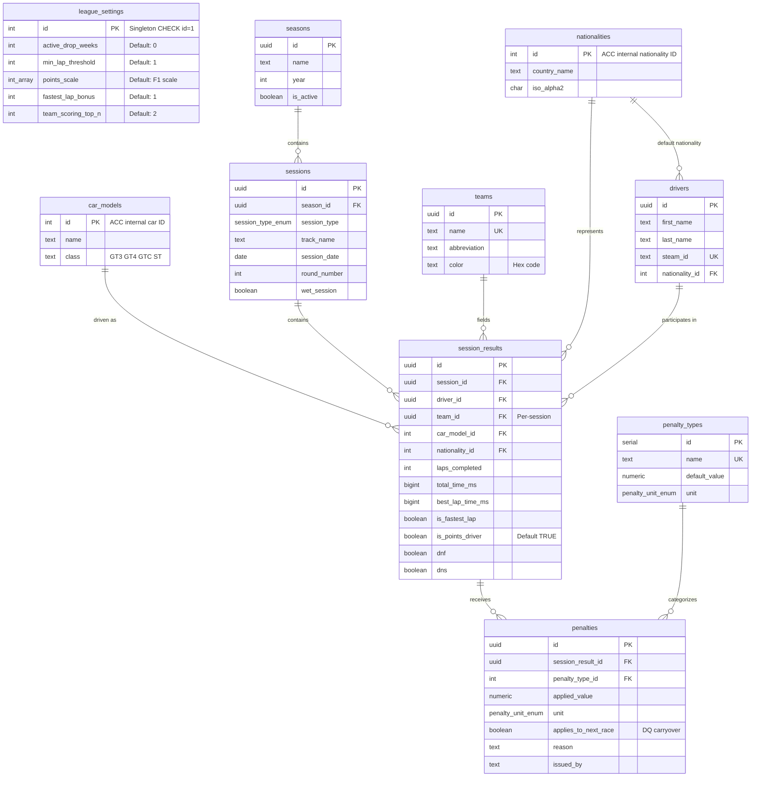

# ACCLeagueDataTool

A PostgreSQL schema for managing an **Assetto Corsa Competizione (ACC)** sim-racing league on **Supabase**. Handles dynamic F1-style point calculations, flexible team rosters, drop weeks, DQ carryover suspensions, and a structured steward penalty ledger — all computed virtually via SQL views with zero mutation of raw result data. Supports multiple seasons.

---

## Features

- **Multi-Season Support** — `seasons` table with `is_active` flag; all views compute standings per-season independently
- **Dynamic F1 Scoring** — Configurable points scale (default: 25-18-15-12-10-8-6-4-2-1) with fastest lap bonus awarded to any classified driver regardless of finishing position
- **Drop Weeks** — Championship standings automatically discard the N lowest race scores per driver via window functions
- **DQ + Next-Race Suspension** — Disqualification penalties can carry over to the next round via `applies_to_next_race`; the scoring view enforces this automatically
- **Penalty Ledger** — 9 pre-loaded penalty types (time, lap, DQ) with steward override support
- **Lap Threshold** — Minimum laps required for classification (designed to scale to % of leader laps)
- **Points-Driver Declaration** — Teams with >2 drivers must declare which drivers are "points drivers" via `is_points_driver` flag; only declared points-drivers count toward team standings
- **Per-Session Teams** — Team assignments live on each result, supporting mid-season transfers
- **Team Championship** — Sum of declared points-drivers per team per race (capped by `team_scoring_top_n`), with independent drop-week logic
- **ACC Data Integration** — Car model and nationality tables pre-seeded with ACC's internal integer IDs
- **Admin-Only RLS** — Single admin role via Supabase `authenticated`; no anonymous access

---

## Schema Overview



---

## Views (Dynamic Scoring Engine)

All standings are computed on-the-fly. **Raw data in `session_results` is never modified.**

| View | Purpose |
|------|---------|
| `v_race_classification` | Official race results: applies penalties (time/lap/DQ + carryover), enforces lap threshold, ranks by laps DESC / time ASC, assigns F1 position points + fastest lap bonus (any classified position) |
| `v_driver_championship` | Championship standings per season with drop-week logic via `ROW_NUMBER()` window functions |
| `v_driver_race_breakdown` | Per-driver, per-race detail with `is_dropped` and `is_suspended_carryover` flags for UI display |
| `v_team_championship` | Team standings per season: declared points-drivers only, capped by `team_scoring_top_n`, with independent drop logic |
| `v_race_detail` | Fully denormalized race view joining driver/team/car/season names for frontend consumption |

### Scoring Pipeline

```
session_results (raw)
    ↓ + penalties (aggregated per result)
    ↓ + suspended_drivers (DQ carryover from previous round)
    ↓ + league_settings.min_lap_threshold
v_race_classification (per-race positions & points, per season)
    ↓ + league_settings.active_drop_weeks
v_driver_championship (season standings)
v_team_championship (team standings, is_points_driver filter)
```

### Classification Order

1. **Classified** — Met lap threshold, not DQ'd, not DNS → sorted by `effective_laps DESC, official_time_ms ASC`
2. **Not Classified** — Below lap threshold → 0 points, sorted after classified
3. **Disqualified** — DQ penalty or carryover suspension → 0 points, sorted after unclassified
4. **DNS** — Did not start → dead last

### DQ Carryover Logic

When a steward issues a `Malicious wrecking` (DQ) penalty with `applies_to_next_race = TRUE`:

1. The driver earns **0 points** for the current race (classified as DQ'd)
2. The `suspended_drivers` CTE in `v_race_classification` automatically detects the carryover
3. In the **next round** (same season), the driver is treated as DQ'd — 0 points, classified last
4. The `is_suspended_carryover` flag distinguishes carryover DQs from direct DQs in the UI

### Drop-Week Logic

```sql
-- Rank each driver's race scores from lowest to highest (within each season)
ROW_NUMBER() OVER (
  PARTITION BY season_id, driver_id
  ORDER BY total_points ASC, round_number ASC
) AS points_rank_asc

-- Discard the N lowest scores
CASE WHEN points_rank_asc <= active_drop_weeks THEN 0
     ELSE total_points END
```

No rows are deleted. The drop is applied purely in the view aggregation.

### Team Scoring — Points-Driver Declaration

Teams are limited to **2 active points-drivers per race**. The `is_points_driver` column on `session_results` controls this:

- **Default**: `TRUE` — all drivers count for team scoring
- **Override**: Teams with >2 drivers must have the admin set `is_points_driver = FALSE` for non-scoring drivers before results are finalized
- **Safety Cap**: Even among declared points-drivers, only the top `team_scoring_top_n` (default: 2) scores per race count

---

## Penalty Catalog

| # | Name | Value | Unit | Notes |
|---|------|-------|------|-------|
| 1 | Minor collision | +30 | seconds | |
| 2 | Significant collision | +45 | seconds | |
| 3 | Track limits | +30 | seconds | |
| 4 | Blue flags minor | +45 | seconds | |
| 5 | Blue flags major | +60 | seconds | |
| 6 | Aggressive driving | +60 | seconds | |
| 7 | Pit speed | +30 | seconds | |
| 8 | Missed pit | −1 | laps | Subtracts 1 from completed laps |
| 9 | Malicious wrecking | — | disqualification | 0 pts this race + DQ next race (via `applies_to_next_race`) |

Stewards can override the default value when issuing a penalty via the `penalties.applied_value` column.

---

## Session Types

| Type | Purpose |
|------|---------|
| `Practice` | Free practice sessions — results stored but not scored |
| `Qualifying` | Qualifying sessions — results stored but not scored |
| `Race` | Race sessions — scored via the views |
| `Entrylist` | Post-qualifying grid snapshot: stores registered entries with driver, car, team, and race number |

The `Entrylist` session type captures the qualifying grid state. In ACC, an entrylist contains entries with `firstName`, `lastName`, `steamID`, `raceNumber`, and `carModelType`. These map directly to `session_results` columns.

---

## Row-Level Security (RLS)

| Role | Access |
|------|--------|
| `authenticated` (admin) | Full CRUD on all tables; `league_settings` restricted to SELECT + UPDATE only (singleton protection) |
| `anon` | **No access** — all tables require authentication |

Views inherit RLS from their underlying tables.

---

## Multi-Season Support

The `seasons` table allows multiple championships to coexist:

```sql
-- Create a new season
INSERT INTO seasons (name, year, is_active) VALUES ('Season 2', 2026, TRUE);

-- All sessions reference a season
INSERT INTO sessions (season_id, session_type, track_name, session_date, round_number)
VALUES ('<season-uuid>', 'Race', 'monza', '2026-07-15', 1);
```

Championship views (`v_driver_championship`, `v_team_championship`) include `season_id` and compute standings independently per season. Filter by season:

```sql
SELECT * FROM v_driver_championship WHERE season_id = '<season-uuid>';
SELECT * FROM v_team_championship WHERE season_id = '<season-uuid>';
```

---

## Getting Started

### Prerequisites

- A [Supabase](https://supabase.com) project (or local Supabase via Docker)
- PostgreSQL 15+ (Supabase default)

### Deploy the Schema

**Option A: Supabase Dashboard**

1. Open your project's **SQL Editor**
2. Paste the contents of [`supabase/migrations/00001_init.sql`](supabase/migrations/00001_init.sql)
3. Click **Run**

**Option B: Supabase CLI**

```bash
# Install Supabase CLI if needed
npm install -g supabase

# Link to your project
supabase link --project-ref <your-project-ref>

# Run migrations
supabase db push
```

**Option C: Direct psql**

```bash
psql -h <host> -U postgres -d postgres -f supabase/migrations/00001_init.sql
```

### Verify

After deployment, confirm the schema:

```sql
-- Check tables (should be 10)
SELECT table_name FROM information_schema.tables
WHERE table_schema = 'public' ORDER BY table_name;

-- Check views (should be 5)
SELECT table_name FROM information_schema.views
WHERE table_schema = 'public' ORDER BY table_name;

-- Verify singleton config
SELECT * FROM league_settings;

-- Check penalty catalog (should be 9)
SELECT * FROM penalty_types;

-- Verify car model count (should be 43)
SELECT COUNT(*) FROM car_models;
```

---

## Configuration

All league settings live in the singleton `league_settings` row:

```sql
UPDATE league_settings SET
  active_drop_weeks  = 2,          -- Drop worst 2 races
  min_lap_threshold  = 5,          -- Must complete 5+ laps
  points_scale       = '{25,18,15,12,10,8,6,4,2,1}',
  fastest_lap_bonus  = 1,          -- +1 for fastest lap (any classified position)
  team_scoring_top_n = 2           -- Top 2 points-drivers count for team
WHERE id = 1;
```

---

## ACC Reference Data

### Car Model IDs

The `car_models` table is pre-seeded with ACC's internal integer → car name mappings (IDs 0–37 for GT3/GTC, 50–61 for GT4). Source: ACC Server Admin Handbook & `BroadcastingEnums.cs`.

### Nationality IDs

The `nationalities` table maps ACC's internal nationality integers (0–87) to country names and ISO 3166-1 alpha-2 codes. IDs 0–49 are verified against the ACC SDK. IDs 50+ are community-sourced — for precision, verify against your installation's `BroadcastingEnums.cs`.

---

## Utility Functions

| Function | Signature | Description |
|----------|-----------|-------------|
| `format_race_time` | `(ms BIGINT) → TEXT` | Converts milliseconds to `H:MM:SS.mmm` format |

---

## Telemetry Ingestion Pipeline

A Python telemetry ingestion pipeline is provided in [`ingest.py`](ingest.py). It uses the `watchdog` library to monitor a local directory for newly generated ACC result `.json` files and uploads them into the Supabase database.

### Features
- **Real-Time Directory Monitoring**: Automatically watches a folder and processes new files as they are written by the ACC server.
- **UTF-16 LE Support**: Gracefully reads and parses files in ACC's native UTF-16 LE encoding with fallback to UTF-8.
- **Relational Entity Resolution**:
  - Dynamically links sessions to the active season.
  - Automatically queries, inserts, or maps drivers by their `steam_id` (cleaning any leading `'S'` prefix).
  - Automatically queries, inserts, or maps teams by name.
  - Validates and creates session instances for tracks, dates, and types if they do not exist yet.
- **Upsert Safety**: Utilizes unique constraints to update existing results if a file is re-processed, preventing duplicate rows or DB errors.
- **Resilient API Retries**: Employs exponential backoff retries via `tenacity` for database operations to ensure robustness against temporary network issues.

### Setup

1. **Install Dependencies**:
   ```bash
   pip install -r requirements.txt
   ```

2. **Configure Environment Variables**:
   Create a `.env` file in the root of the project:
   ```env
   SUPABASE_URL="https://your-project-ref.supabase.co"
   SUPABASE_SERVICE_ROLE_KEY="your-service-role-key"
   WATCH_DIR="./results"
   # Optional: Link all ingested sessions to a specific season UUID.
   # If not specified, the script automatically resolves/creates an active season.
   # SEASON_ID="your-season-uuid"
   ```

3. **Run the Ingest Daemon**:
   ```bash
   python ingest.py
   ```

---

## Web Application (SPA Dashboard)

A React Single Page Application (SPA) built with **Vite, React, Tailwind CSS, Recharts**, and **`@supabase/supabase-js`** provides a premium, dark-themed dashboard for viewing league standings and telemetry as well as managing steward workflows.

### Features
- **Public Championship Leaderboard**: Lists driver and constructor standings, with gold/silver/bronze podium borders and highlights.
- **Historical Telemetry Data Warehouse**: Browsable data grid filtering all recorded sessions (Practice, Quali, Race, Entrylist) by Track, Session Type, Car, or Country.
- **Interactive Dashboards**: Real-time head-to-head driver finishing comparison and cumulative team point timelines utilizing Recharts.
- **Steward Log Penalty Form**: Allows Stewards to select a session and driver, select an infraction type (preloaded database values), and log a penalty.
- **Supabase Auth**: Secure authentication gate for the Steward Portal using Supabase Auth.
- **League Settings Manager**: Interface to update singleton configuration variables (`active_drop_weeks`, `min_lap_threshold`, `points_scale`, `team_scoring_top_n`).
- **Reference Catalog Editor**: Add or edit reference rows for `car_models` and `nationalities` tables directly.

### Frontend Setup

1. **Install Dependencies**:
   ```bash
   npm install
   ```

2. **Configure Environment Variables**:
   Add client variables to your `.env` or `.env.local` file:
   ```env
   VITE_SUPABASE_URL="https://your-project-ref.supabase.co"
   VITE_SUPABASE_ANON_KEY="your-anon-public-key"
   ```

3. **Run Locally (Dev Mode)**:
   ```bash
   npm run dev
   ```

4. **Production Build**:
   ```bash
   npm run build
   ```

### Automated GitHub Pages Deployment

This repository includes a GitHub Actions CI/CD workflow [`.github/workflows/deploy.yml`](.github/workflows/deploy.yml) that automatically builds the Vite React application and deploys it to the `gh-pages` branch whenever commits are pushed to `main`.

To enable this:
1. **Configure Repository Actions Secrets**:
   Go to your GitHub repository -> **Settings -> Secrets and variables -> Actions**, and add the following repository secrets:
   - `VITE_SUPABASE_URL`: Your Supabase API URL.
   - `VITE_SUPABASE_ANON_KEY`: Your Supabase public anon key.
2. **Enable GitHub Pages**:
   Go to your GitHub repository -> **Settings -> Pages**. Under **Build and deployment -> Branch**, select `gh-pages` and `/ (root)`, then click **Save**.

---

## License

MIT