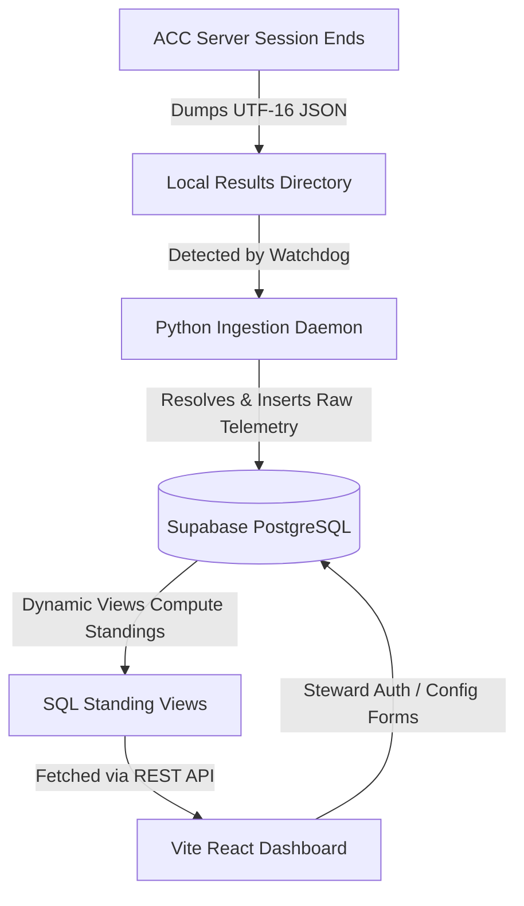

# ACC League Data Tool — Deployment & Workflow Plan

This document outlines the step-by-step workflow required to deploy, connect, and run the ACC racing league data pipeline and dashboard.



---

## Start-to-Finish Operational Plan

### Phase 1: Supabase Database Setup
1. **Initialize Project**: Create a new project in the [Supabase Dashboard](https://supabase.com).
2. **Execute Migration**: Deploy the schema by running the initialization script [`supabase/migrations/00001_init.sql`](supabase/migrations/00001_init.sql) in the Supabase SQL Editor.
3. **Register Steward User**:
   Run the steward account creator helper script in the repository:
   ```bash
   python create_steward.py
   ```
   Follow the prompts to enter the steward's email and password. This will automatically register the account and confirm the email using your Supabase service role key (bypassing confirmation emails).

### Phase 2: Telemetry Ingestion Daemon Configuration
1. **Install Dependencies**:
   ```bash
   pip install -r requirements.txt
   ```
2. **Setup Environment Variables**:
   Create a `.env` file in the project root:
   ```env
   SUPABASE_URL="https://your-project-ref.supabase.co"
   SUPABASE_SERVICE_ROLE_KEY="your-supabase-service-role-key"
   WATCH_DIR="C:/Program Files (x86)/Steam/steamapps/common/Assetto Corsa Competizione Dedicated Server/server/results"
   ```
   *Note: Use the **service role key** here, as it has bypass-RLS clearance to insert rows.*
3. **Start the Ingestor**:
   Run the daemon to monitor folder changes:
   ```bash
   python ingest.py
   ```

### Phase 3: React SPA Dashboard Deployment
1. **Install Node Packages**:
   ```bash
   npm install
   ```
2. **Setup Client Environment Variables**:
   Create a `.env.local` file:
   ```env
   VITE_SUPABASE_URL="https://your-project-ref.supabase.co"
   VITE_SUPABASE_ANON_KEY="your-supabase-anon-public-key"
   ```
   *Note: Use the **anon public key** here, as it respects RLS rules to protect write endpoints.*
3. **Run Dev Environment**:
   ```bash
   npm run dev
   ```
4. **Compile and Host**:
   Generate production static files:
   ```bash
   npm run build
   ```
   Deploy the resulting `dist/` directory to Vercel, Netlify, Supabase hosting, or any static provider.
